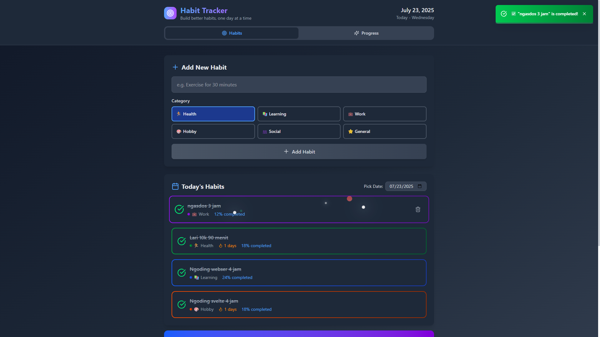
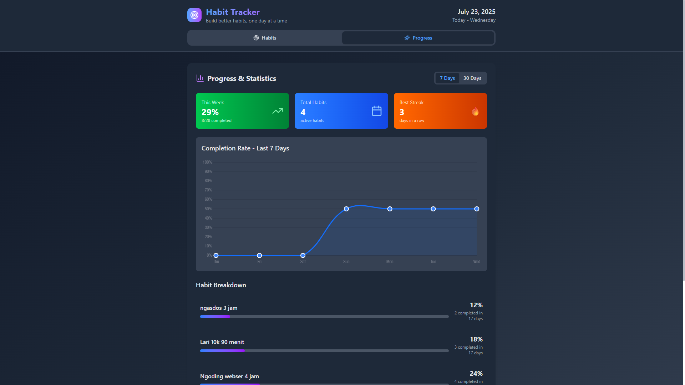

# Habit Tracker

### Track, visualize, and improve your daily habits with a sleek, accessible, and responsive web app built using SvelteKit, TypeScript, and Tailwind CSS.


## Features

- Add, edit, and delete daily habits
- Mark habits as completed for each day
- Visual progress chart
- Responsive, mobile-first design
- Light and dark mode
- Local storage for persistent data
- Modern UI with Tailwind CSS
- Social links in the footer
- **Accessibility:**
  - Keyboard navigation for all interactive elements
  - ARIA labels for tabs and navigation
  - High-contrast color modes
  
## Screenshots

<p align="center">
  
  
</p>


## Tech Stack

- [SvelteKit](https://kit.svelte.dev/)
- [TypeScript](https://www.typescriptlang.org/)
- [Tailwind CSS](https://tailwindcss.com/)
- [Lucide Icons](https://lucide.dev/icons/)
- [Chart.js](https://www.chartjs.org/)

## Getting Started

1. **Clone the repository:**
   ```bash
   git clone https://github.com/yourusername/habit-tracker-svkit.git
   cd habit-tracker-svkit
   ```
2. **Install dependencies:**
   ```bash
   npm install
   ```
3. **Run the development server:**
   ```bash
   npm run dev
   ```
4. Open [http://localhost:5173](http://localhost:5173) in your browser.

## Project Structure

```
├── src/
│   ├── lib/
│   │   ├── components/         # Svelte components (HabitForm, HabitList, etc.)
│   │   └── stores/             # Svelte stores for state management
│   ├── routes/                 # SvelteKit routes (+page.svelte, etc.)
│   └── app.css                 # Global styles
├── static/                     # Static assets (favicon, etc.)
├── package.json
├── tailwind.config.ts
├── svelte.config.js
└── vite.config.ts
```

##  Get In Touch
<div align="center">
  <a href="https://www.instagram.com/corneliusyoga" target="_blank"></a>&nbsp;
  <a href="https://www.linkedin.com/in/cornelius-yoga-783b6a291" target="_blank"></a>&nbsp;
  <a href="https://www.youtube.com/channel/UCj0TlW5vLO6r_Nlwc8oFBpw" target="_blank"></a>&nbsp;
  <a href="https://czy.digital" target="_blank"></a>
  <br/><br/>
  
  <br/>
  <sub>Made by Cornelius Ardhani Yoga Pratama</sub>
</div>